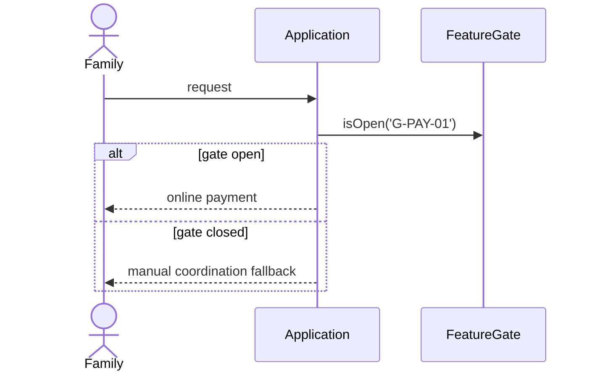

# design.md — the technical design phase

Source: [kiro.dev/docs/specs/feature-specs/requirements-first](https://kiro.dev/docs/specs/feature-specs/requirements-first/).

`design.md` is written **after** approved requirements (Requirements-First) or **before** them
(Design-First, where requirements are then derived from it).

## Sections kiro.dev names

| Section | Content |
|---|---|
| Architecture | components and how they interact |
| Sequence diagrams | interaction flows — Mermaid, matching `docs/architecture/overview.md` |
| Data models and interfaces | tables, value objects, contracts |
| Technology stack | which parts of the baseline this uses |
| Error handling | failure modes and responses |
| Testing strategy | how the requirements get proven |

## This repository's additions

**Authority line.** State the documents this design must obey, and name them precisely. This
matters more than it sounds: finding **N-11** was a real column-name conflict where a spec's own
`design.md` contradicted the two documents its `requirements.md` cited as authority. The cited
chain won. If your design disagrees with a cited authority, that is a conflict to surface, not a
choice to make silently.

**Module boundary.** Name which module from `docs/architecture/overview.md` §5 owns any new table.
If none fits, say so explicitly rather than cramming it into an unrelated module — finding
**N-13** is exactly that gap left visible instead of hidden.

**Event names come from the catalogue.** Any domain event must use a type from
`docs/contracts/event-catalog.md`. If the event you need is not catalogued, say so (finding
**N-12**); do not quietly invent a permanent name.

**Platform foundations are consumed, never redefined.** `docs/specs/README.md`: *"a feature spec
may consume a foundation but must not redefine one."* Identity, feature gates, audit, outbox,
notifications, document vault, payment adapter, and financial ledger each own their tables and
state contracts. Reference them.

**Gate reads are server-side.** Any design that shows a gated capability must read it through
`ModeResolver` / `FeatureGateResolver`. A front-end flag is never the enforcement point.

**Design system is not optional.** Reference `docs/design/design-system.md` — GATE 6 of
`ci/verify-docs.sh` fails the build without it. Name the `<x-mk.*>` primitives and tokens the
screens will use; never invent a component or a raw hex value.

## Sequence-diagram convention

Always draw the closed-gate branch. A diagram with only the happy path is how a fallback silently
stops being built.

## Procedure

1. Re-read the approved `requirements.md`. Every criterion needs a home in this design.
2. Read the authority documents the requirements cite — actually open them; do not paraphrase from
   memory.
3. Draft architecture → data model → interfaces → sequence diagrams → error handling → testing.
4. Cross-check: any table already owned by a platform foundation? any event already catalogued?
   any conflict between cited authorities?
5. List what the design deliberately does **not** cover, with the reason.
6. Stop at the approval gate: confirm feasibility, and flag any human-gated area (auth, money,
   privacy, migrations, DNS, production) before tasks are written.
