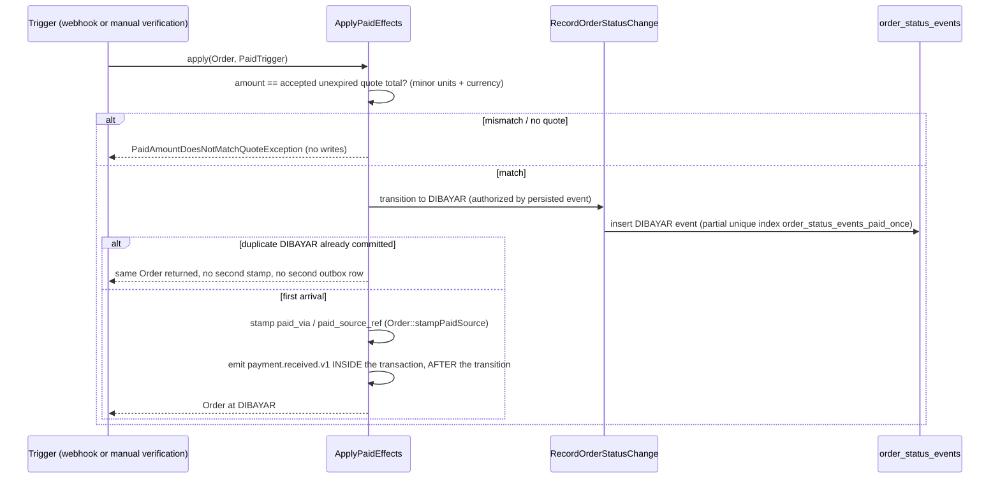

# Design — Booking and Order Orchestration

## Authority

Obeys this spec's own `requirements.md` (AC1–AC14), `docs/domain/order-lifecycle.md`
(canonical states, transition matrix, branch rules), `docs/domain/domain-model.md`,
`docs/security/rbac-matrix.md` (payment-opening authorization), and
`docs/contracts/notification-matrix.md` + `docs/contracts/event-catalog.md`
(dispatch and the one allowed order event name). No other document is cited as
authority here, so there is no conflict to resolve.

## Module boundary

The domain half of the nine-step booking workflow; `public-booking-wizard` is the
presentation half (see that spec's normative Boundary table and this spec's own
`tasks.md` "eight overlapping acceptance criteria"). Owned here: product-type
routing, quote versioning, the payment guard's upstream conditions, the order
state machine, the paid-effects path, the Step 9 read model, and order-scoped
notifications. Commercial state stays structurally separate from case/work/
certificate state (`funeral-case-model.md:35`, `domain-model.md:165`).

## Components

`OrderStatus` (closed enum, 13 states) + `OrderTransition` (forward-only edge
graph), `SubmitBookingDraft` (product-type router + idempotent submission),
`RecordOrderStatusChange` (the sole writer of `order_status_events` and
`orders.status`), `ApplyPaidEffects` (the sole writer of `DIBAYAR` and of
`paid_via`/`paid_source_ref`), `AuthorizeOrderPaymentOpening`, `OrderReadModel`
(Step 9), `DispatchOrderNotifications`, `IssueQuote`/`AcceptQuote` +
`Quote`/`QuoteLine` (immutable versioned quotes), `AttachOrderDocument`
(composes DocumentVault). Models: `Order`, `OrderStatusEvent`, `OrderParty`,
`DeceasedProfile`, `OrderDocument`, `Quote`, `QuoteLine`.

## Sequence — payment effects, exactly-once



The partial unique index `order_status_events_paid_once (order_id) WHERE
to_status = 'DIBAYAR'` is the sole exactly-once mechanism — a database
invariant, deliberately, because the cross-path race (manual verification vs
late webhook for the same order) is concurrent and cannot be resolved by
application logic alone. `Journal::post()` is deliberately not called: no
`entity_ref` (badan usaha) column chain reaches an Order while `FIN-DEC-01` is
`TBD`, so a guessed implementation is not authorized (financial-model.md §4).

## Data

```text
orders(id, reference, product_type, status, booking_draft_id, funeral_case_id,
       pre_need_case_id, paid_via, paid_source_ref, correlation_id,
       idempotency_key, timestamps)
order_status_events(id, order_id, from_status, to_status, actor_ref, actor_role,
       reason, metadata, occurred_at)  -- append-only; one DIBAYAR per order
order_parties(id, order_id, user_id, role)
deceased_profiles(id, order_id, ...)
order_documents(id, order_id, document_id)
quotes(id, order_id, version_number, status, total_minor, currency,
       issued_at, expires_at, accepted_at, superseded_at)
quote_lines(id, quote_id, service_package_version_id, price_version_id,
       price_version_number, description, quantity, unit_amount_minor,
       line_total_minor, currency, fulfillment_owner)
funeral_cases(id, booking_draft_id, status, urgency, area, owner, deadlines)
pre_need_interests(id, booking_draft_id, status, contact)
```

Money is integer minor units, converted from `decimal:2` exactly once at quote
issuance (`Money::fromDecimal`). PostgreSQL CHECK constraints pin order status
columns to the 13 canonical values and `orders.product_type` to the enum.
Migrations follow expand/contract; `down()` is non-destructive where the
table outlives the batch.

## Error handling

- **Illegal transition** (`IllegalOrderTransitionException`): throws and writes
  nothing; the sole writer re-reads `lockForUpdate()` inside a transaction
  before asserting the edge.
- **Direct status writes** (`OrderIsGuardedException`): `update()`/
  `performUpdate()`/`delete()` and `touch()` throw; status moves only through
  `RecordOrderStatusChange`, and the authorized `applyStatus()` door requires an
  already-persisted `OrderStatusEvent` whose `to_status` is the target.
  `Order::query()->update()` and `DB::table('orders')->update()` are a known,
  documented open hole — never used on the money path.
- **Payment effects precondition**: amount one minor unit off the accepted
  unexpired quote total, or a differing currency, throws
  `PaidAmountDoesNotMatchQuoteException` before any write.
- **Duplicate paid arrival**: collides on the partial unique index, is
  swallowed, and returns the same `Order` — same confirmation, never a second
  stamp or outbox row (design-system.md §6.6).
- **Guard denial** (`OrderPaymentOpeningNotAuthorisedException`,
  `DomainDenied`/`UnavailableUpstream` results): explanatory states, never a
  silent no-op and never a raw 403 (§6.4). Condition 6 stays
  `UnavailableUpstream` citing `FIN-DEC-01` until the decision lands.
- **Channel failure**: notification dispatch never changes business state;
  delivery is never claimed without delivery state.

## Technology stack

No new infrastructure. Laravel 13 / PostgreSQL 18 (SQLite `:memory:` in the
hermetic suite), existing Outbox and `Audit::wrap()` seams, `Money` from
`FinancialLedger`, DocumentVault for all order documents, Redis queues per
`queue-and-outbox.md`. No Octane/Kubernetes/GraphQL/separate SPA.

## Testing strategy

Unit: transition-graph exhaustiveness (no backward edge, terminal absorbing,
nothing terminal after `DIBAYAR`). Feature: real rows walked forward along real
graph edges — never fixtures that cheat past the model guard. Payment effects
are mutation-checked (remove stamp, drop catch, reorder outbox emission, relax
amount equality, loosen token check — each watched fail and restored).
Exactly-once cross-path (manual then webhook, and the reverse) asserts one
`order_status_events` row and one outbox row. PostgreSQL-18-specific invariants
(partial unique index, CHECK constraints, two-connection sequential re-read)
are verified on a disposable real PG18 container; `lockForUpdate()` is a no-op
on SQLite, so lock-based claims are only proven there. Follows the no-factory,
real-seeded-row convention.

## Explicitly not covered, deliberately

- **Merchant registry / badan usaha**: no `entity_ref` column chain reaches an
  Order; `FIN-DEC-01` is `TBD`, so `Journal::post()` and the merchant-side
  settlement gate are not implemented. A missing decision closes the gate; it
  does not authorize a guessed implementation.
- **`PaymentIntentDecision::Allowed`**: the guard still cannot reach PASS — with
  conditions 2–5 satisfied by real records it is still `DENIED` on condition 6.
  The change that lets an online payment open needs human sign-off and is not
  made here.
- **Invoice production**: `FIN-DEC-02` is `TBD`; Step 9 exposes invoice state as
  a read-model state only and produces no invoice.
- **Pre-Need payment**: while `G-LEGAL-01` is closed, Pre-Need is interest-only —
  no payment object, invoice, or financial obligation is ever created.
- **True two-writer concurrency**: a genuine parallel-connection race against
  `order_status_events_paid_once` is not exercised on the 2/4 host; the
  sequential cross-session re-read and the database invariant itself are
  verified on real PG18. The plan's Task 10 records this honestly.
