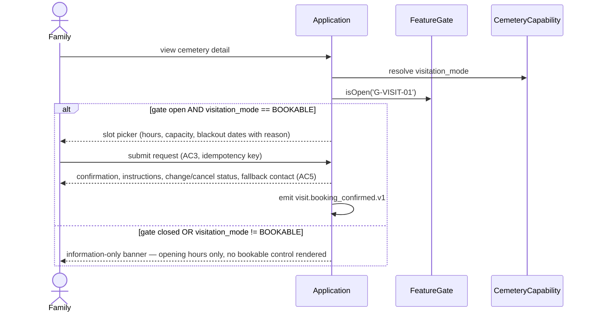

# Design — Visitation Booking

## Authority

Obeys `docs/architecture/overview.md` §5 (module: **Visitation** — "Visit booking, access instructions, facilities, capacity") and §6 (capability shape: `visitation_mode = NONE | INFORMATION_ONLY | BOOKABLE`), `docs/governance/assumptions-and-gates.md` (**G-VISIT-01**, fallback "Information-only/off"), `docs/contracts/event-catalog.md`, and `docs/product/mvp-scope.md` §8 (excluded from MVP — no screen-inventory ID yet, per tasks.md's own note).

## Components

`VisitationCapability` (mode resolver — reads `visitation_mode` server-side, never a front-end flag, per tasks.md §6.9), `VisitationRequest` (customer intake, AC3/AC5), `VisitationCalendar` (operator view, scoped to the operator's assigned cemetery only — AC6), `NavigationProjection` (AC4 — a projection service, never raw `GraveRegistry` exposure).

## Data

```text
visit_schedules          -- per-cemetery hours, confirmation policy (AC2)
visit_capacity_slots     -- discrete bookable slots derived from schedule + capacity + blackout dates (AC2)
visit_bookings           -- visitor count, contact, accessibility needs, status, idempotency key (AC3, AC7)
visit_facility_requests  -- facility requests attached to a booking (AC3)
visit_events             -- audit trail a confirmed/cancelled booking emits
```

**Table ownership:** `visitation_mode` itself is a field on `cemetery_capability_profiles`, owned by `CemeteryCapability` (`cemetery-directory-and-availability`'s own module) — this spec reads it and must not duplicate or redefine it, the same non-ownership discipline that spec's own design.md already applies to `PlotInventory`. The five tables above belong to this module.

## Sequence — booking request (both gate branches)



## Error handling

- **Duplicate submission (AC7):** idempotency key on `visit_bookings`; a repeated submission returns the *same* confirmation, never a second row.
- **Notification failure:** asynchronous with fallback — a failed email/WhatsApp send never changes booking state; the booking stays confirmed regardless of delivery outcome.
- **Capacity/blackout conflict:** rejected at submission with a specific reason surfaced to the customer (§6.2 — never a bare "tidak tersedia").
- **Cemetery hours change after a booking exists:** not covered by any AC either way; this design's position is that existing confirmed bookings are not retroactively invalidated by a later schedule change, only new requests are affected — flagged here as a judgement call, not a cited requirement.
- **Navigation (AC4):** `NavigationProjection` only, never a raw `GraveRegistry` query — mirrors `PublicCapabilityProjection`'s non-exposure pattern in `cemetery-directory-and-availability`.

## Testing strategy

Negative-first, matching this repo's own testing convention: information-only mode renders zero bookable controls; cross-cemetery access (AC6) denies without revealing the other cemetery's data; a repeated submission (AC7) asserts one row and an identical confirmation; the closed-gate branch renders information-only regardless of the stored `visitation_mode` value.

## Deliberately not covered

- No screen-inventory ID yet (`mvp-scope.md` §8 excludes this from MVP) — add one before building, per tasks.md's own note.
- Cancellation/no-show: `event-catalog.md` catalogues only `visit.booking_confirmed.v1`. No cancelled/no-show event exists yet; this design does not invent one — add it to the catalogue before building cancellation.
- AC2's "confirmation policy" (manual review vs. auto-confirm) is named as a per-cemetery variable but its approval workflow is not designed here — belongs to whichever module owns operator-facing review queues, not decided by this spec.
