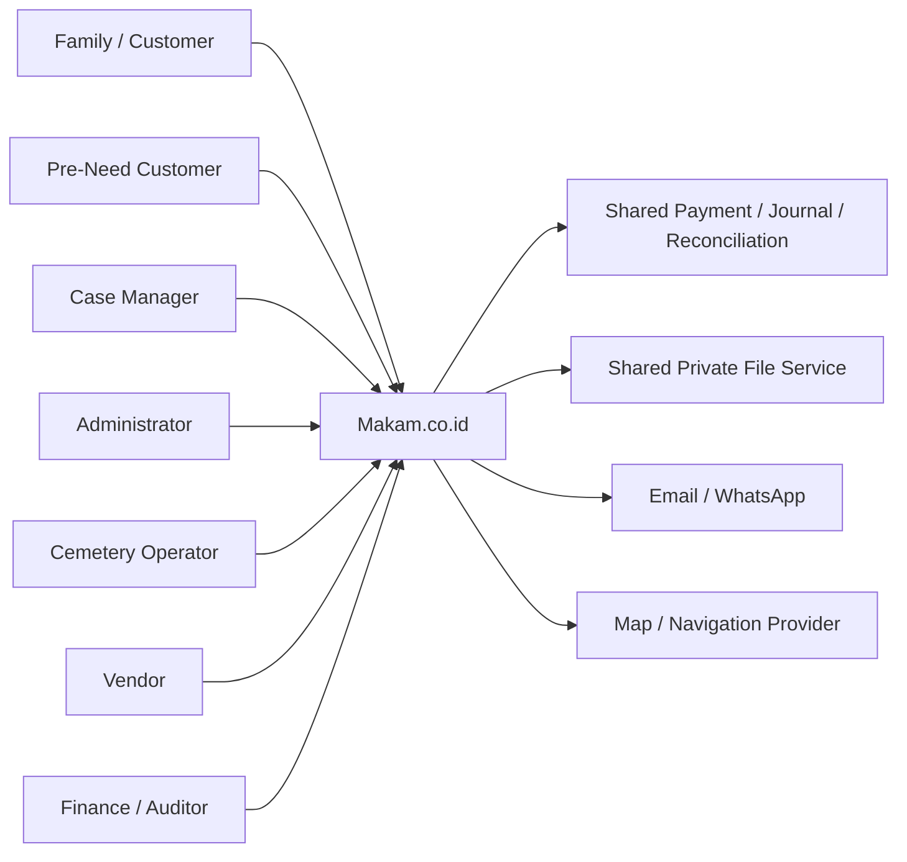
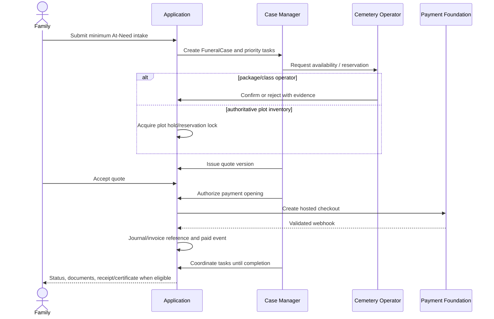
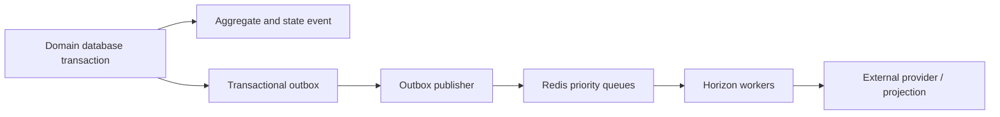

# Architecture Overview — Makam.co.id

## 1. Status

**Accepted technical baseline v0.4.** RKS does not mandate a stack. Benchmark-derived modules are explicitly optional/gated.

## 2. Architecture drivers

- Different cemeteries have different data and operational maturity.
- At-Need requires human-owned case orchestration and deadlines.
- Pre-Need requires contract/liability lifecycle separate from At-Need.
- Plot booking must prevent double reservation when enabled.
- Payment gate follows manual confirmation or authoritative reservation, quote acceptance, and admin authorization.
- Record-level access applies to customer, operator, vendor, case, plot, memorial, and document.
- Sensitive files use short signed URLs and audited access.
- Fuzzy search must meet the RKS target on 100k records.
- Import, reminders, billing cycles, certificates, and notifications must be idempotent.
- Shared K1–K8 foundations remain external contracts.

## 3. Technology profile

| Layer | Accepted baseline |
|---|---|
| Runtime | PHP 8.5 on Ubuntu 24.04 LTS, PHP-FPM |
| Application | Laravel 13 modular monolith |
| Public UI | Blade + Livewire 4 + Tailwind CSS 4.1+; isolated Alpine/JS modules when necessary |
| Admin/operator/vendor | Filament 5 panels with explicit panel access, policies, and query scoping |
| Database | Managed PostgreSQL 18 current minor; `pg_trgm`, `unaccent`; PostGIS only when approved |
| Queue/cache/locks | Managed Redis 8.2, Laravel Queue + Horizon, non-cluster topology |
| Events | PostgreSQL transactional outbox plus versioned event envelope |
| File storage | S3-compatible private quarantine and accepted storage |
| API | OpenAPI 3.1 |
| Payments | Hosted checkout via shared K3–K5 foundation |
| Observability | Structured logs, error tracking, Horizon, Pulse, uptime, DB/Redis metrics, audit |
| Delivery | Immutable CI build, expand/contract migrations, staged deployment and rollback |

Full version and upgrade rules are canonical in `technology-baseline.md`.

## 4. System context



## 5. Module boundaries

| Module | Responsibility |
|---|---|
| IdentityAccessAdapter | K1/K2 identity, actor context, roles, record scopes |
| CemeteryDirectory | TPU/TPS identity, facilities, media, location |
| CemeteryCapability | Availability/booking/map/registry modes and activation evidence |
| ServiceCatalog | Service definitions, package bundles, price sources |
| PlotInventory | Optional authoritative block/plot units and status |
| PlotReservation | Optional temporary hold/reservation with locking and expiry |
| Booking | Draft/intake and shared booking data |
| FuneralCase | At-Need/Urgent owner, tasks, deadlines, communications, appointments, incidents |
| PreNeed | Interest, consultation, proposal, contract, payment schedule, activation/claim |
| Quotation | Immutable quote versions and line items |
| OrderWorkflow | Forward-only commercial/operational state machines |
| AgreementCertificate | Booking form, contract, receipt, certificate, replacement/revocation |
| DocumentVaultAdapter | K6 private files and access audit |
| PaymentAdapter | K3/K4/K5 integration |
| Marketplace | Catalog and commercial order allocation |
| VendorFulfillment | Vendor order/work order, schedule, evidence, quality outcome |
| GraveRegistry | Grave identity, source provenance, import, search, claim/access policy |
| Renewal | Tariff source, renewal, outside-system marking |
| CareSubscription | Billing cycle and care fulfillment schedule |
| Visitation | Visit booking, access instructions, facilities, capacity |
| Memorial | Optional memorial profile, QR token, privacy and moderation |
| NotificationAdapter | Email/WhatsApp flags, template and fallback |
| AuditAdapter | Append-only audit references |
| FeatureGate | Legal, data, capability, provider, and operational gate enforcement |

## 6. Heterogeneous cemetery capability

Each cemetery has a versioned capability profile:

```text
availability_mode = INDICATIVE | PACKAGE_CLASS | SPECIFIC_PLOT
booking_mode      = REQUEST_CONFIRMATION | RESERVE_PLOT | DIRECT_PURCHASE
map_mode          = LOCATION_ONLY | BLOCK_MAP | PLOT_MAP
registry_mode     = NONE | BASIC | AUTHORITATIVE
certificate_mode  = NONE | MANUAL | PLATFORM_MANAGED
visitation_mode   = NONE | INFORMATION_ONLY | BOOKABLE
```

Capability activation requires owner, evidence, effective date, and rollback/deactivation behavior.

## 7. Critical At-Need flow



## 8. Critical Pre-Need flow

```mermaid
flowchart LR
    Interest[Interest / Consultation]
    Selection[Package or Plot Selection]
    Hold[Optional Reservation]
    Proposal[Proposal / Quote]
    Contract[Agreement]
    Schedule[Payment Schedule]
    Settlement[Settlement]
    Certificate[Certificate]
    Activation[Future Activation / Claim]

    Interest --> Selection --> Hold --> Proposal --> Contract --> Schedule --> Settlement --> Certificate --> Activation
```



Payment nodes remain disabled while legal/financial gate is closed.

## 9. Data architecture

Core entities include:

- `cemeteries`, `cemetery_capability_profiles`, `blocks`, `plots`, `plot_status_events`, `plot_reservations`;
- `service_packages`, `service_package_items`, `services`, `service_prices`;
- `booking_drafts`, `funeral_cases`, `case_tasks`, `case_communications`, `case_appointments`;
- `orders`, `quotes`, `quote_lines`, `order_status_events`;
- `agreements`, `agreement_versions`, `certificates`, `certificate_events`;
- `grave_records`, `grave_sources`, `grave_import_batches`, `grave_claims`;
- `vendor_orders`, `work_orders`, `work_evidence`;
- `renewals`, `care_subscriptions`, `subscription_cycles`;
- `visit_bookings`, `memorial_profiles`, `memorial_qr_tokens`;
- references to external payments, journal, reconciliation, files, notifications, and audit.

## 10. Key concurrency controls

- Plot reservation uses database row/advisory locking or equivalent atomic provider contract.
- One active reservation per plot at a time.
- Quote acceptance references immutable version.
- Webhook, reminder window, subscription cycle, certificate issuance request, and renewal period use unique idempotency constraints.
- Case task completion is versioned to prevent lost updates.

## 11. Failure strategy

- Operator silent: case manager/admin fallback remains available.
- Plot inventory stale: disable specific-plot booking and fall back to request confirmation.
- Reservation expiry: release plot and require reconfirmation; never silently charge.
- Urgent capacity unavailable: close affected area/time and contact active cases.
- Certificate provider/manual process delayed: show pending issuance, preserve payment/order completion separately.
- Memorial privacy dispute: unpublish immediately without deleting audit/evidence.
- Payment/provider failures preserve authoritative unpaid state.

## 12. Known limitations

- Legal and accounting design for paid Pre-Need is unresolved.
- Land marketplace is not approved by this architecture.
- Public benchmark capabilities do not prove operator readiness or regulatory compliance.
- Contractual general NFR and final retention remain TBD. v0.4 defines provisional engineering performance and recovery targets pending approval.


## 13. Public MVP experience

```text
PublicWeb
├── HomepageNavigation
├── BookingWizard (Steps 1–9)
├── FuneralMarketplace
├── RenewalJourney
├── PublicFAQ
└── OrderTracking
```

Canonical public data comes from product catalogs and published master data. The application must not scatter hard-coded variants across Livewire components.

## 14. MVP route-to-module mapping

| Route | Module |
|---|---|
| `/` | PublicExperience |
| `/pemesanan-makam/*` | Booking + Directory + ServiceCatalog |
| `/marketplace/*` | Marketplace + VendorFulfillment |
| `/perpanjangan/*` | GraveRegistry + Renewal |
| `/faq/*` | Content/FAQ |
| `/admin/*` | AdminOperations |
| `/vendor/*` | VendorPortal |

## 15. Fallback architecture

External gates are adapted behind explicit modes:

```text
PaymentMode = ONLINE | MANUAL_COORDINATION
WhatsAppMode = ACTIVE | EMAIL_IN_APP_FALLBACK
PreNeedMode = PAID_CONTRACT | INTEREST_ONLY
GraveSearchMode = ACTIVE | MANUAL_ASSISTANCE
```

UI and domain behavior must read server-side mode; front-end flags alone are insufficient.


## 16. Reliable asynchronous architecture



Critical financial/operational events use the outbox. Consumers are idempotent. Queue topology is defined in `queue-and-outbox.md`.

## 17. Production topology

```text
CDN/WAF
  -> reverse proxy/load balancer
  -> Laravel PHP-FPM web instances

Horizon workers and scheduler/outbox publisher run as separate processes

Dependencies:
- managed PostgreSQL 18 with PITR
- managed Redis 8.2 primary/replica, non-cluster
- private S3-compatible quarantine/accepted storage
- shared K1–K8/provider adapters
```

The same modular-monolith artifact may scale horizontally. Kubernetes and Octane are deferred until measured need.

## 18. Security/runtime boundaries

- Session authentication and mandatory privileged MFA.
- Filament panels have explicit access checks and record scope.
- Untrusted files cannot cross quarantine boundary without validation and scan.
- Payment/journal/reconciliation data crosses only typed adapters and durable records.
- Logs/telemetry exclude restricted content and full identifiers.

## 19. Delivery and recovery

- Lockfile-based immutable builds.
- Expand/contract migrations.
- Managed PostgreSQL backup/PITR and regular restore tests.
- Feature/payment kill switches for safe degradation.
- Performance and concurrency evidence before production activation.

## 20. Combined development and staging topology

```text
Ubuntu 22.04 LTS host — 2 vCPU / 4 GB
├── host reverse proxy/TLS
├── development web container
├── staging web container
├── one constrained staging Horizon pool
├── shared PostgreSQL 18, separate databases/users
├── shared Redis 8.2, separate namespaces/queues
└── external sandbox providers/object storage
```

This topology is deliberately smaller than production. It validates functional integration and staging/UAT, but does not provide production HA, PITR, or formal production capacity evidence. Application versions remain pinned by immutable containers. See ADR-0027 and `operations/dev-staging-environment.md`.
