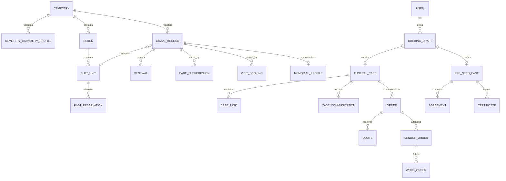

# Domain Model — v0.2

## 1. Bounded contexts

```text
Cemetery Directory & Capability
Plot Inventory & Reservation (optional)
Service Catalog & Bundles
Booking Intake
Funeral Case Management
Pre-Need Contracting
Quotation & Order Workflow
Agreements & Certificates
Payments & Reconciliation (external adapter)
Marketplace & Vendor Fulfillment
Grave Registry & Renewal
Care Subscription
Visitation & Memorial
Operations, Security & Audit
```

## 2. Core aggregates

### Cemetery

TPU/TPS identity, address, facilities, owner/operator, and active capability profile.

**Rules:**

- Type is `TPU` or `TPS`.
- Capabilities are explicit and versioned; UI cannot infer them from data presence alone.
- Unknown capability defaults to safest mode.

### CemeteryCapabilityProfile

Defines availability, booking, map, registry, certificate, and visitation modes.

**Rules:** activation requires owner, evidence, effective date, and audit.

### PlotUnit — optional

Authoritative individual grave unit under a cemetery/block.

**Rules:**

- Only exists for `registry_mode=AUTHORITATIVE`.
- Has immutable external/source identity and status history.
- Public exposure is separate from internal operational existence.

### PlotReservation — optional

Time-bound hold/reservation for one plot and one booking/pre-need process.

**Rules:** one active reservation per plot; atomic acquisition; explicit expiry; no payment after invalid expiry.

### ServicePackage

Commercial/operational bundle with included, optional, and excluded items.

### BookingDraft

Resumable user input. At submission it creates the correct product workflow rather than one universal order.

### FuneralCase

At-Need/Urgent operational aggregate.

**Contains:** case manager, urgency, service area, deadlines, contacts, tasks, communications, appointments, linked order, documents, incidents, and evidence.

**Rules:**

- One accountable case owner at a time.
- Urgent cannot be accepted without active capacity gate.
- Commercial status does not replace task/fulfillment status.

### PreNeedCase

Interest/consultation, proposed package/plot, reservation, agreement, payment schedule, certificate, and future activation/claim.

**Rules:** no payment while legal gate is closed; contract and cancellation terms are versioned.

### Quote

Immutable price proposal. Revision creates a new version.

### Order

Commercial root linked to an At-Need case, Pre-Need case, renewal, care cycle, or marketplace order.

### Agreement

Versioned legal/operational document with acceptance evidence.

### Certificate

Versioned issued record such as utilization certificate. Replacement/revocation is an event, not destructive overwrite.

### GraveRecord

Registered deceased/grave information with canonical source identity, provenance, access mode, and optional plot link.

### VendorOrder / WorkOrder

Vendor commercial allocation and field fulfillment are separate. Paid does not mean completed.

### CareSubscription

Recurring commercial agreement; each cycle creates invoice and fulfillment/work order separately.

### VisitBooking

Time-bound visit/ziarah request with capacity/facility options when supported.

### MemorialProfile

Optional public/private memorial content and QR token with consent, moderation, and unpublish controls.

## 3. Product type separation

```text
AT_NEED_SERVICE_ORDER
PRE_NEED_PLOT_PURCHASE
FUNERAL_PROTECTION_MEMBERSHIP
CARE_SUBSCRIPTION
MARKETPLACE_PRODUCT_ORDER
RENEWAL_ORDER
```

No shared lifecycle beyond generic references such as customer, invoice, payment, and document.

## 4. Relationships



## 5. Cross-domain invariants

1. Payment session implies valid availability confirmation or active authoritative reservation, accepted quote, and payment authorization.
2. Order paid implies validated shared payment evidence.
3. One active plot reservation per plot.
4. Reservation must remain valid at payment session creation; policy for expiry during checkout is explicit.
5. Quote total equals immutable line items.
6. Case/task and order/payment statuses are distinct.
7. Pre-Need payment is impossible while legal gate is closed.
8. Certificate issuance never rewrites an earlier issued version.
9. Public memorial/QR projection contains only explicitly allowed fields.
10. Vendor and operator access is query-scoped.
11. One reminder per grave/window; one invoice per care cycle; one online/external renewal settlement per period.
12. Land listing or transfer cannot be enabled by generic marketplace flags.

## 6. Terminology

| Term | Meaning |
|---|---|
| At-Need | Service required after a death or for immediate burial |
| Pre-Need | Future-use preparation/purchase before death; legally gated |
| FuneralCase | Human-owned operational coordination record |
| Capability profile | Explicit modes supported by one cemetery |
| Authoritative inventory | Source contract trusted for plot existence/status and atomic reservation |
| Plot hold | Short-lived lock before confirmed reservation/purchase |
| Certificate | Versioned issued domain record with file representation |
| Memorial | Optional remembrance content, not authoritative grave registry |
