# Domain and Financial Model — v0.4

## 1. Scope and authority

Makam.co.id consumes shared K3 Journal, K4 Payment, and K5 Reconciliation foundations. This document defines the **minimum contract and invariants** those foundations must satisfy before online money movement is activated.

It does not guess the merchant-of-record, tax, or legal-accounting answer. Those require stakeholder/legal/accounting approval recorded in `FIN-DEC-01` through `FIN-DEC-06`.

## 2. Financial separation by product type

| Product type | Typical billing | Financial obligation |
|---|---|---|
| At-Need service | One-time or approved DP | Immediate service delivery |
| Pre-Need plot purchase | Booking fee/DP/installment | Long-term right/service liability; gated |
| Funeral protection | Periodic contribution | Future benefit/claim; outside MVP |
| Care subscription | Recurring invoice | Recurring work fulfillment |
| Marketplace order | One-time | Product/service delivery and vendor payable |
| Renewal | One-time per period | Update of authorized renewal period |

These lifecycles must not share a generic “subscription balance” implementation.

## 3. Required financial objects

```text
Quote / QuoteVersion
Invoice / InvoiceLine
PaymentAttempt
ProviderTransaction
WebhookEvent
LedgerBatch / LedgerEntryReference
ReconciliationRecord
ReconciliationException
Refund / RefundAllocation
VendorPayable
VendorPayout
ExternalPaymentMarking
PaymentSchedule (only for approved products)
```

Domain tables may store references to shared K3–K5 records, but they must not create a second mutable ledger.

## 4. Merchant and entity binding

Every quote, invoice, payment attempt, provider transaction, ledger batch, refund, payable, and payout carries an immutable `badan_usaha`/merchant context.

Before online payment activation, approve:

| Decision | Required answer |
|---|---|
| FIN-DEC-01 | Merchant of record and contracting entity per product type |
| FIN-DEC-02 | Invoice issuer and tax treatment |
| FIN-DEC-03 | Platform fee/commission and recognition policy |
| FIN-DEC-04 | Refund, cancellation, dispute, and chargeback owner |
| FIN-DEC-05 | Vendor payable timing, hold, and payout approval |
| FIN-DEC-06 | Reconciliation ownership, SLA, and exception authority |

A missing decision closes the relevant payment/settlement gate; it does not authorize a guessed implementation.

## 5. Booking money path

```mermaid
flowchart LR
  Confirm[Availability confirmation or active reservation]
  Quote[Accepted immutable quote]
  Open[Authorized payment opening]
  Attempt[Payment attempt]
  Checkout[Hosted checkout]
  Webhook[Validated durable webhook]
  Tx[Provider transaction]
  Journal[Balanced journal batch reference]
  Invoice[Invoice/receipt state]
  Reconcile[Reconciliation]

  Confirm --> Quote --> Open --> Attempt --> Checkout --> Webhook --> Tx --> Journal --> Invoice --> Reconcile
```



## 6. Ledger contract

K3 must provide append-only, balanced postings or an equivalent invariant-preserving journal.

Minimum rules:

1. A journal batch is immutable after posting.
2. Total debits equal total credits for each currency and entity.
3. Corrections use reversal/compensating entries, never updates/deletes.
4. Every batch references source event, provider transaction, invoice/order, entity, amount, currency, and occurred time.
5. Unique source/idempotency constraints prevent duplicate posting.
6. Ledger entries are not derived from mutable order totals after posting.
7. Reconciliation can trace provider gross, fee, net settlement, bank receipt, refund, and payout.

Conceptual posting names are defined by accounting approval, not hard-coded in domain code. Example only:

```text
Payment received
Debit  Gateway Receivable
Credit Customer Funds / Revenue / Payable allocation
```

## 7. Payment invariants

- Checkout amount comes only from an accepted active quote version.
- Payment requires valid manual confirmation or active authoritative reservation.
- Browser return URL never marks paid.
- Webhook is stored before processing, signature-checked, merchant-scoped, amount/currency-checked, replay-protected, and idempotent.
- Duplicate/replayed webhook cannot duplicate transaction, journal, invoice, notification, reservation conversion, or order transition.
- A provider `success` event with amount/entity mismatch becomes an exception, not paid state.
- Payment completion, service completion, vendor acceptance, and certificate issuance are separate milestones.
- Payment for expired reservation is blocked or placed in exception handling according to approved policy.

## 8. Payment state model

```text
PaymentAttempt
CREATED -> CHECKOUT_OPENED -> PENDING
        -> SUCCEEDED
        -> FAILED
        -> EXPIRED
        -> CANCELLED
        -> EXCEPTION
```

Provider events may arrive out of order. State projection must use provider event time/version rules and never downgrade a settled fact without a compensating event.

## 9. Invoice model

```text
DRAFT -> ISSUED -> PENDING_PAYMENT -> PAID
                   -> EXPIRED
                   -> CANCELLED
PAID -> REFUND_PENDING -> PARTIALLY_REFUNDED -> REFUNDED
     -> DISPUTED -> CHARGEBACK
```

Invoice number allocation must be unique per approved issuer/series and audited. Receipt and invoice semantics must not be conflated without accounting approval.

## 10. Refund and chargeback

Refunds are explicit objects with:

- original transaction/invoice;
- reason and initiator;
- approved amount and line allocation;
- provider reference;
- journal reversal/adjustment reference;
- vendor payable impact;
- status and timestamps;
- maker/checker evidence where required.

```text
REQUESTED -> REVIEWED -> APPROVED -> SUBMITTED -> SETTLED
          -> REJECTED
          -> FAILED
```

Partial refund must allocate product/service, fee, tax, delivery, and vendor payable consistently. Chargeback creates an exception and compensating financial entries; it does not rewrite the original payment.

## 11. Vendor payable and payout

A vendor payable is created from an approved allocation rule, not directly from `order.total`.

```text
VendorPayable
PENDING_FULFILLMENT
-> ELIGIBLE
-> HELD
-> APPROVED
-> PAID_MANUAL | SUBMITTED_PROVIDER
-> SETTLED | FAILED
-> ADJUSTED
```

Controls:

- paid customer order does not immediately imply eligible payout;
- fulfillment/complaint/hold policy determines eligibility;
- bank-account change requires verification, re-authentication, and audit;
- payout requires maker/checker for finance-sensitive thresholds;
- manual payout stores proof and bank reference;
- automated payout remains gated until provider and reconciliation behavior are proven.

## 12. Reconciliation

K5 performs at least:

```text
internal payment attempts
↔ provider transactions
↔ provider settlement/fee report
↔ bank receipt where available
↔ ledger batches
↔ invoices/refunds/payouts
```

Exception categories include missing webhook, duplicate provider reference, amount mismatch, merchant mismatch, fee mismatch, settlement missing, late success, unknown transaction, refund mismatch, and payout failure.

Exceptions are assigned, aged, resolved with evidence, and never silently ignored.

## 13. Manual payment fallback

Manual payment is a distinct controlled path:

```text
instructions issued
-> reference/proof received
-> verification pending
-> approved or rejected
-> journal/invoice effects exactly once
```

Admin cannot mark paid through an unrestricted status dropdown. Approval uses a dedicated Action, permission, evidence, transaction, and audit event.

## 14. At-Need, Pre-Need, marketplace, and subscription specifics

### At-Need

Full payment or DP requires an approved policy defining minimum DP, remaining due, fulfillment release, cancellation, and emergency exceptions.

### Pre-Need

Paid Pre-Need stays closed until legal object/right, reserve/trust/liability, price guarantee, cancellation/refund, continuity, certificate, and activation/claim are approved.

### Marketplace

MVP is single-vendor checkout. Multi-vendor requires split allocation, partial refund, tax/fee allocation, dispute, and reconciliation design.

### Care subscription

Billing and fulfillment remain independent:

```text
Subscription ACTIVE
Invoice PAID
CareCycle SCHEDULED
WorkOrder COMPLETED
Evidence ACCEPTED
```

## 15. Online payment activation checklist

- [ ] FIN-DEC-01 through FIN-DEC-06 approved.
- [ ] Hosted checkout and merchant routing tested.
- [ ] Webhook signature/replay/amount/entity tests pass.
- [ ] Balanced journal contract and duplicate prevention pass.
- [ ] Reconciliation against provider sandbox/sample reports passes.
- [ ] Refund and payment-exception runbooks approved.
- [ ] Manual fallback remains operational.
- [ ] Monitoring and alerts configured.
- [ ] Restore and replay/idempotency tests pass.
