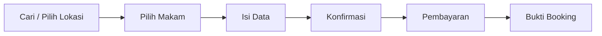
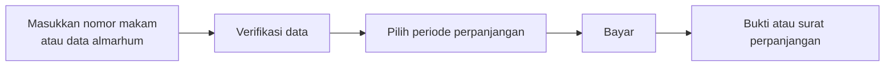
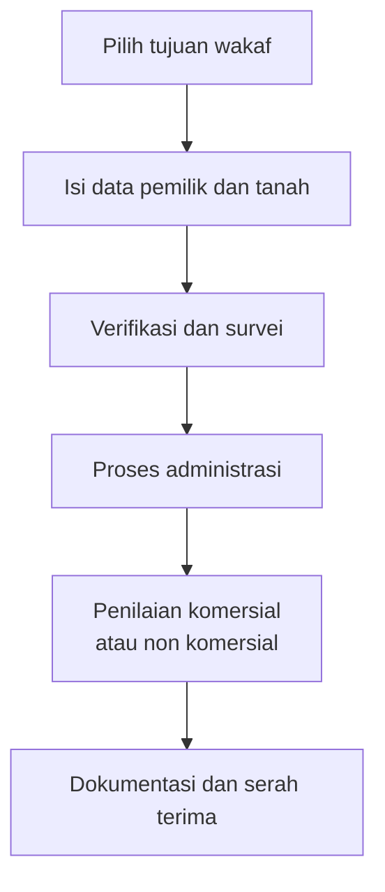

# PRD Makam.co.id — Yayasan Indonesia Emas Merdeka

Product Requirements Document, 18 September 2026. Disiapkan untuk Yayasan Indonesia Emas Merdeka (YIEM).
Sumber: deck "Website Menu & User Flow, Makam.co.id × Fund for Indonesia", sepuluh slide.

> **Kedudukan dokumen ini di repo (direkonsiliasi 19 Sep 2026).** Ini dokumen
> stakeholder untuk YIEM, bukan sumber otoritas produk. Urutan otoritas tetap
> seperti `AGENTS.md` §Source precedence: RKS K23–K35 →
> [`mvp-scope.md`](mvp-scope.md) → ADR dan spec yang disetujui. Di mana teks
> PRD bertentangan dengan keputusan yang sudah final di repo, barisnya direvisi
> dan ditandai **(Rev.)**, teks aslinya dipertahankan di §15, dan alasannya
> dicatat di §16. Yang sudah dibangun tidak diulang di sini;
> [`docs/domain/traceability-matrix.md`](../domain/traceability-matrix.md)
> adalah sumber kebenarannya. Katalog layanan, marketplace, fasilitas, dan
> dokumen dirujuk ke berkas kanoniknya, tidak disalin.

## 1. Ringkasan

Makam.co.id adalah platform layanan pemakaman end to end: pemesanan makam, perpanjangan masa pakai, layanan perawatan dan pemakaman, serta fasilitasi wakaf tanah pemakaman.

Proposisi nilai: keluarga bisa menemukan lokasi makam yang tersedia, mengetahui harga di muka, dan menyelesaikan pemesanan dalam satu alur singkat, tanpa harus mendatangi banyak pengelola.

Pesan utama homepage: "Layanan Pemakaman Lebih Mudah, Jelas, dan Terpercaya." CTA utama Cari Makam, CTA sekunder Perpanjang Makam, Layanan Pemakaman, dan Wakaf Tanah. Elemen kepercayaan yang harus tampil di area pertama: lokasi terverifikasi, harga transparan, dan bantuan proses administrasi.

**(Rev.)** Empat kartu layanan homepage tetap Pemesanan Makam, Layanan Pemakaman, Perpanjangan Makam, dan FAQ sesuai `AGENTS.md` §Mandatory MVP UX. Wakaf Tanah tampil sebagai CTA sekunder di hero, persis seperti slide 10, dan sebagai item menu pendukung. Kontak bantuan tampil sebagai elemen tetap di bawah hero, bukan CTA pesaing, memenuhi kewajiban customer-service CTA di `mvp-scope.md` §1. "Lokasi terverifikasi" berarti TPU/TPS yang capability profile-nya diaktifkan dengan persetujuan pemilik dan bukti; lihat glosarium `docs/domain/domain-model.md` §6.

## 2. Konteks dan latar belakang

Urusan pemakaman umumnya diputuskan dalam kondisi mendesak dan berduka, sementara informasi lokasi, harga, dan prosedur administrasi tersebar serta tidak transparan. Perpanjangan masa penggunaan makam dan perawatan berkala juga tidak punya kanal mandiri, sehingga bergantung pada kontak manual ke pengelola.

Prinsip UX yang berlaku, sesuai deck: menu utama singkat, CTA jelas, proses transparan, status transaksi mudah dilacak, dan trust serta accountability ditampilkan sejak awal.

**(Rev.)** Kondisi saat ini: sistem sudah berjalan di lingkungan dev dan beta. Repo memuat 28 spec fitur, 41 ADR, tiga panel Filament (admin, pengelola, vendor), serta alur publik untuk direktori TPU/TPS, pemesanan, pencarian perpanjangan, marketplace, akun, pusat bantuan, dan langganan perawatan. Data lokasi dikelola lewat panel admin, bukan manual. Asumsi yang masih perlu dikonfirmasi YIEM: YIEM bertindak sebagai penyelenggara sekaligus pemilik legalitas. Nama YIEM dan Fund for Indonesia tidak muncul di dokumen repo mana pun sebelum PRD ini.

## 3. Struktur menu utama

Rekomendasi navigation bar untuk versi awal website, mengikuti slide 3 deck.

| Menu | Cakupan menurut deck | Rute di repo |
| --- | --- | --- |
| Pemesanan Makam | Cari lokasi, pilih makam, booking | `/pemesanan-makam` |
| Perpanjangan Makam | Perpanjang masa penggunaan makam | `/perpanjangan` |
| Layanan Pemakaman | Bunga, batu nisan, perawatan makam atau rumput | `/marketplace` |
| Wakaf Tanah | Fasilitasi tanah untuk pemakaman sosial atau keluarga | **(Rev.)** halaman informasi, rute baru; bukan kartu layanan keempat, lihat §1 |

Menu pendukung yang disarankan: Tentang Kami, Daftar Lokasi Makam, FAQ, Hubungi Kami, dan Masuk atau Akun Saya.

**(Rev.)** Daftar Lokasi Makam memakai direktori yang sudah ada di `/pemakaman`, Hubungi Kami memakai pusat bantuan di `/bantuan`, FAQ di `/faq`, Masuk di `/masuk`, Akun Saya di `/akun`. Hanya Tentang Kami yang halaman baru, berisi identitas YIEM sebagai penyelenggara dan legalitasnya. Halaman ini dan halaman Wakaf Tanah adalah halaman statis mengikuti pola Privasi dan Syarat Ketentuan, bukan artikel FAQ. Tentang Kami ditahan, dan tautannya tidak dipasang, sampai YIEM memberikan nama badan hukum, alamat, dan dasar legalitas; tidak ada teks umum pengganti.

> Deck menyebut CTA homepage di dua tempat dengan rumusan berbeda. Slide 4 menuliskan tiga CTA utama, yaitu Cari Makam Sekarang, Lihat Lokasi Tersedia, dan Hubungi Bantuan. Slide 10 mempersempitnya menjadi satu CTA utama Cari Makam, dengan Perpanjang Makam, Layanan Pemakaman, dan Wakaf Tanah sebagai CTA sekunder. Rekomendasi slide 10 yang dipakai di dokumen ini, karena sejalan dengan prinsip satu CTA utama per halaman.

## 4. Target pengguna

| Persona | Situasi | Yang dibutuhkan dari platform | Istilah repo |
| --- | --- | --- | --- |
| Keluarga duka | Butuh makam dalam hitungan jam, sedang berduka, tidak paham prosedur | Ketersediaan real time, harga jelas, alur pemesanan pendek, kontak bantuan | Pemesan (At-Need) |
| Ahli waris | Mengurus perpanjangan atau perawatan makam keluarga | Pencarian makam berdasarkan nomor atau data almarhum, pengingat jatuh tempo, bukti perpanjangan | Ahli waris |
| Perantau | Tinggal jauh dari lokasi makam | Layanan perawatan berkala dan dokumentasi kondisi makam | Pelanggan CareSubscription |
| Calon wakif | Ingin mewakafkan tanah untuk pemakaman | Informasi syarat, alur verifikasi dan survei, dokumen serah terima | **(Rev.)** dilayani lewat halaman informasi dan kanal kontak di rilis 1 |
| Pengelola makam | Yayasan, swasta, atau pengelola area pemakaman | Panel pengelolaan blok dan ketersediaan, daftar pesanan masuk, rekap pembayaran | Pengelola TPU/TPS (cemetery operator) |
| Admin YIEM | Operator internal | Verifikasi pesanan, penanganan kasus manual, pelaporan | Administrator platform |

## 5. Tujuan dan metrik keberhasilan

1. Memperpendek waktu dari pencarian sampai bukti booking menjadi satu sesi kunjungan.
2. Menjadikan harga dan prosedur administrasi terbaca di muka, tanpa negosiasi manual.
3. Mengubah perpanjangan dan perawatan makam menjadi pendapatan berulang.

| Metrik | Definisi | Target awal |
| --- | --- | --- |
| Conversion pencarian ke booking | Booking dibayar dibagi sesi yang membuka daftar makam | Ditentukan setelah satu bulan data dasar |
| Waktu penyelesaian booking | Median dari halaman pencarian sampai bukti booking terbit | Di bawah 15 menit |
| Tingkat penyelesaian pembayaran | Pembayaran sukses dibagi invoice terbit | Di atas 70 persen |
| Perpanjangan tepat waktu | Perpanjangan dibayar sebelum jatuh tempo dibagi total jatuh tempo | Di atas 50 persen pada tahun pertama |
| Attach rate layanan tambahan | Booking yang menyertakan minimal satu layanan pemakaman | Di atas 20 persen |
| Lokasi aktif | Lokasi makam dengan ketersediaan terverifikasi dan diperbarui mingguan | Sesuai target ekspansi per kota |

Angka target di atas adalah usulan awal, bukan komitmen; perlu dikunci bersama YIEM sebelum pengembangan dimulai.

**(Rev.)** Rilis 1 hanya mencatat data mentah untuk dua metrik yang sudah bisa dihitung dari order dan ledger: waktu dari draft pertama sampai konfirmasi, dan rasio invoice terbayar. Keduanya diturunkan dari stempel waktu yang sudah ada (draft dibuat, pesanan dikonfirmasi, invoice dibayar) dan dibaca lewat laporan di panel admin, tanpa tabel analitik baru. Tidak ada dashboard metrik sampai target dikunci YIEM. Conversion dan attach rate menyusul setelah ada analitik.

## 6. Ruang lingkup rilis pertama

### Masuk

- Pencarian dan filter lokasi makam berdasarkan kota atau kabupaten, jenis makam, harga, ketersediaan, dan fasilitas. **(Rev.)** Kota, jenis, dan fasilitas wajib; fasilitas memakai daftar tertutup [`facility-catalog.md`](facility-catalog.md). Harga dan ketersediaan aktif hanya bila datanya ada untuk TPU tersebut, dengan pesan jujur bila tidak.
- Halaman detail lokasi dan detail makam dengan harga, foto, dan status ketersediaan.
- Pemesanan makam sampai terbit bukti booking. **(Rev.)** Alur At-Need saja; Pre-Need tetap pendaftaran minat sampai gate legal terbuka (ADR-0010).
- Perpanjangan makam mandiri berbasis nomor makam atau data almarhum.
- Katalog layanan pemakaman: bunga, batu nisan, pembersihan makam, perawatan rumput atau taman, dokumentasi kondisi, paket perawatan berkala. **(Rev.)** Tanpa kode produk baru; pembersihan, perawatan rumput, dan foto kondisi adalah isi tiap siklus paket perawatan dan bukti kerjanya. Daftar produk kanonik di [`marketplace-catalog.md`](marketplace-catalog.md), add-on pemesanan di [`service-catalog.md`](service-catalog.md).
- ~~Formulir pengajuan wakaf tanah sampai tahap verifikasi dan survei.~~ **(Rev.)** Halaman informasi Wakaf Tanah: tujuan wakaf, syarat umum, enam langkah alur dari slide 5 sebagai gambaran proses, dan kanal kontak yang sama dengan pusat bantuan. Tanpa formulir dan tanpa unggahan.
- Akun pengguna dengan riwayat pesanan dan dokumen.
- Panel admin untuk lokasi, ketersediaan, pesanan, dan pembayaran. **(Rev.)** Ditambah panel pengelola, yang sudah ada dan masuk rilis 1 (lihat MK-11).
- Pembayaran melalui payment gateway dengan invoice dan bukti bayar. **(Rev.)** Online ketika gate pembayaran aktif; fallback manual dengan verifikasi admin ketika tidak, sesuai `mvp-scope.md` §7.

### Dikecualikan dari rilis pertama

- Aplikasi mobile native; web responsif dulu.
- Peta interaktif per petak makam; cukup daftar blok dan nomor.
- Marketplace multi vendor untuk layanan pemakaman; vendor dikurasi manual. Satu vendor per checkout (ADR-0015).
- Integrasi langsung ke sistem dinas atau pemerintah daerah.
- Penilaian komersial aset wakaf secara otomatis; tetap proses manual dengan dokumentasi di sistem.
- Pembayaran cicilan atau paylater.
- **(Rev.)** Intake wakaf dengan formulir dan unggahan dokumen tanah; menyusul di fase berikutnya dengan gate legal.
- **(Rev.)** Pre-Need berbayar; tetap terkunci gate legal.

## 7. Kebutuhan fungsional

Prioritas memakai MoSCoW: M wajib rilis pertama, S sebaiknya ada, C bisa menyusul. Baris bertanda **(Rev.)** diubah dari teks 18 Sep; teks aslinya di §15.

| ID | Modul | User story | Kriteria terima | Pri |
| --- | --- | --- | --- | --- |
| MK-01 | Pencarian | Sebagai keluarga duka saya mencari makam berdasarkan kota agar cepat menemukan yang tersedia | **(Rev.)** Filter kota, jenis, dan fasilitas berfungsi bersamaan; fasilitas dari daftar tertutup. Filter harga dan ketersediaan aktif hanya untuk TPU yang punya tarif bersumber dan availability mode di atas indicative; TPU tanpa data tetap tampil dengan keterangan jujur. Hasil menampilkan sisa unit bila mode ketersediaannya mendukung | M |
| MK-02 | Detail makam | Sebagai pemesan saya melihat harga dan fasilitas sebelum memesan | Halaman menampilkan blok, nomor, harga total, biaya tambahan, dan dokumen yang perlu dibawa | M |
| MK-03 | Pemesanan | Sebagai pemesan saya mengisi data pemesan dan almarhum lalu membayar | **(Rev.)** Empat langkah sesuai keputusan 2 Sep 2026. Formulir memuat data pemesan dan almarhum serta kebutuhan layanan tambahan. Penguncian unit mengikuti availability mode TPU: konfirmasi paket/kelas sebagai default, plot hold atomik hanya di TPU dengan inventori otoritatif (ADR-0011). Metode pembayaran tersedia online atau fallback manual; invoice terbit | M |
| MK-04 | Bukti booking | Sebagai pemesan saya menerima bukti booking yang bisa ditunjukkan ke pengelola | **(Rev.)** Nomor pesanan, detail lokasi, kontak pengelola berupa nomor telepon dan jam layanan singkat (atribut TPU yang diisi admin, keduanya opsional; fallback ke kontak CS platform bila kosong), daftar dokumen dari [`required-document-catalog.md`](required-document-catalog.md) yang disnapshot ke pesanan, status layanan. Terkirim via email; WhatsApp bila gate aktif, dan UI menyatakan bila belum tersedia | M |
| MK-05 | Perpanjangan | Sebagai ahli waris saya memperpanjang masa pakai makam secara mandiri | **(Rev.)** Pencarian makam via nomor atau data almarhum, verifikasi data, pilihan periode, pembayaran online atau manual, konfirmasi dan kwitansi untuk semua perpanjangan. Surat perpanjangan digital sebagai Certificate berversi hanya di TPU yang certificate_mode-nya aktif | M |
| MK-06 | Pengingat | Sebagai ahli waris saya diingatkan sebelum masa pakai habis | **(Rev.)** Notifikasi otomatis pada H-90, H-30, dan H-7 ke satu kontak ahli waris yang tercatat dan menyetujui, email sebagai kanal dasar. Hanya untuk makam yang tanggal jatuh temponya diketahui platform (hasil perpanjangan lewat platform atau impor pengelola). Persetujuan dihubungi diambil lewat kotak centang pada langkah konfirmasi perpanjangan dan disimpan bersama kontak; impor pengelola wajib membawa flag persetujuan, tanpa flag berarti tanpa pengingat. Makam yang jatuh temponya baru diketahui saat jendela sudah lewat hanya menerima jendela terdekat yang masih di depan. Satu pengingat per makam per jendela | S |
| MK-07 | Layanan pemakaman | Sebagai pengguna saya memesan bunga, nisan, atau perawatan makam | **(Rev.)** Katalog dengan harga, penjadwalan, dan status pengerjaan, memakai kode produk kanonik marketplace. Status bayar dan status pengerjaan terpisah | M |
| MK-08 | Paket berkala | Sebagai perantau saya berlangganan perawatan makam berkala | Paket bulanan atau tahunan, jadwal kunjungan, laporan foto tiap pengerjaan. **(Rev.)** Laporan foto adalah bukti kerja tiap siklus CareSubscription, bukan produk terpisah | S |
| MK-09 | Wakaf tanah | Sebagai calon wakif saya mengajukan wakaf tanah | **(Rev.)** Rilis 1: halaman informasi berisi tujuan wakaf, syarat umum, enam langkah proses, dan kanal kontak pusat bantuan. Tanpa formulir dan unggahan. Intake penuh dengan verifikasi dan survei menjadi fase berikutnya, dibuka hanya setelah gate legal dan pemilik proses verifikasi ditetapkan | M |
| MK-10 | Akun | Sebagai pengguna saya melihat riwayat pesanan dan dokumen | Riwayat booking, perpanjangan, layanan, dan unduhan dokumen dalam satu halaman | M |
| MK-11 | Panel pengelola | Sebagai pengelola makam saya memperbarui ketersediaan dan memproses pesanan | CRUD lokasi, blok, unit, harga; daftar pesanan dengan status; ekspor rekap. **(Rev.)** Masuk rilis 1, bukan Fase 3; panel sudah ada. Input oleh admin YIEM adalah fallback, bukan jalur utama | M |
| MK-12 | Bantuan | Sebagai pengguna saya menghubungi bantuan saat proses mendesak | **(Rev.)** Kanal telepon tampil di setiap langkah alur pemesanan. WhatsApp ditambahkan bila gate aktif | M |
| MK-13 | Ulasan dan verifikasi lokasi | Sebagai calon pemesan saya melihat lokasi mana yang terverifikasi | **(Rev.)** Badge verifikasi diturunkan dari capability profile aktif yang evidence dan owner-nya terisi dan effective_at-nya sudah lewat, bukan toggle editorial. TPU yang belum memenuhi syarat tidak diberi badge negatif; hanya tanggal pembaruan ketersediaan bila ada. Foto lokasi dan tanggal pembaruan ketersediaan terakhir dari observed/synced time inventori. Ulasan pengguna tidak masuk rilis 1 | C |

## 8. Alur pengguna utama

Alur pemesanan dibuat sesingkat mungkin karena kebutuhannya biasanya mendesak.

Deck membagi alur ini menjadi tiga blok: booking lokasi dengan filter kota atau kabupaten, jenis makam, harga, ketersediaan, dan fasilitas; data dan pembayaran yang memuat data pemesan dan almarhum, kebutuhan layanan tambahan, metode pembayaran, dan invoice; lalu konfirmasi berisi nomor booking, detail lokasi, kontak pengelola, dokumen yang perlu dibawa, dan status layanan.

**(Rev.)** Enam kotak di atas adalah model mental pelanggan, bukan jumlah layar. Produk menampilkannya dalam empat langkah: Cari dan Pilih Makam satu layar, Isi Data satu layar, Konfirmasi dan Pembayaran dua layar berikutnya. Alur ini At-Need; Pre-Need punya alur pendaftaran minat terpisah (ADR-0010).

> Tambahan di luar deck: unit yang dipilih dikunci sementara saat pengguna masuk ke halaman data, dan dilepas otomatis jika pembayaran tidak selesai dalam batas waktu yang disepakati. **(Rev.)** Berlaku hanya di TPU dengan inventori otoritatif; di TPU lain, langkah ini adalah konfirmasi ketersediaan paket/kelas oleh pengelola.

Perpanjangan makam:

**(Rev.)** Ditampilkan dalam tiga langkah sesuai keputusan 2 Sep 2026. Kotak E adalah konfirmasi dan kwitansi; surat perpanjangan hanya di TPU dengan certificate_mode aktif.

Wakaf tanah:

**(Rev.)** Di rilis 1 diagram ini ditampilkan sebagai gambaran proses di halaman informasi. Langkah B ke F dijalankan lewat kanal kontak dan proses manual YIEM, tidak di dalam sistem.

## 9. Kebutuhan non fungsional dan teknis

| Aspek | Ketentuan |
| --- | --- |
| Platform | Web responsif, mobile first; mayoritas pengguna mengakses dari ponsel saat kondisi mendesak |
| Performa | Halaman pencarian tampil di bawah 3 detik pada jaringan 4G |
| Ketersediaan | Uptime 99,5 persen; alur pemesanan dan pembayaran harus punya halaman status bila gateway gagal |
| Konkurensi | **(Rev.)** Satu unit makam tidak boleh terjual dua kali. Di TPU dengan inventori otoritatif, penguncian atomik di level basis data dengan satu reservasi aktif per petak. Di TPU lain, konfirmasi paket/kelas oleh pengelola sebelum pembayaran (ADR-0003, ADR-0011) |
| Keamanan data | Data almarhum dan ahli waris adalah data pribadi; enkripsi saat transit dan saat disimpan, akses panel berbasis peran. Dokumen KTP, KK, dan surat kematian disimpan privat dengan karantina dan pemindaian (ADR-0023) |
| Audit | Setiap perubahan ketersediaan, harga, dan status pesanan tercatat beserta pelakunya (ADR-0005) |
| Stack | TALL stack dengan Filament untuk panel admin dan pengelola, sesuai arah pengembangan makam.co.id saat ini. **(Rev.)** Baseline terpin di `docs/architecture/technology-baseline.md` |
| Integrasi | Payment gateway lokal (SumoPod, ADR-0033 dan ADR-0036), pengiriman notifikasi email dan WhatsApp (WhatsApp di-gate), penyimpanan dokumen dan foto |
| Bahasa | Bahasa Indonesia saja pada rilis pertama |

## 10. Model bisnis

| Sumber pendapatan | Mekanisme | Sifat |
| --- | --- | --- |
| Pemesanan makam | Komisi atau margin per unit terjual dari pengelola mitra | Sekali per transaksi |
| Perpanjangan | Biaya layanan per perpanjangan | Berulang, siklus beberapa tahun |
| Layanan pemakaman | Margin atas bunga, nisan, pembersihan, dan perawatan | Sekali dan berulang |
| Paket perawatan berkala | Langganan bulanan atau tahunan | Berulang |
| Wakaf tanah | Tidak dikomersialkan; biaya administrasi atau ditanggung yayasan | Non komersial |

Besaran komisi dan biaya layanan belum ditetapkan dan perlu keputusan YIEM, karena memengaruhi tampilan harga di halaman detail. Di repo ini tercatat sebagai FIN-DEC-03 di `docs/domain/financial-model.md`.

## 11. Rencana rilis bertahap

| Fase | Cakupan | Syarat lolos fase | Status 19 Sep 2026 |
| --- | --- | --- | --- |
| Fase 0, fondasi | Struktur data lokasi, blok, unit, harga; panel admin; **(Rev.)** panel pengelola | Data minimal satu lokasi siap tayang | Dibangun. Panel admin dan pengelola ada; lokasi peluncuran Jakarta, Bogor, Depok, Tangerang, Bekasi diseed |
| Fase 1, MVP | Pencarian, detail, pemesanan, pembayaran, bukti booking | Transaksi nyata pertama berhasil end to end. **(Rev.)** Transaksi lewat fallback manual yang terverifikasi admin dan tercatat di ledger dihitung lolos | Sebagian besar dibangun. Gate pembayaran online tertutup; fallback manual berjalan. Belum: filter fasilitas tertutup, kontak pengelola dan daftar dokumen di bukti booking |
| Fase 2, pendalaman | Perpanjangan, pengingat jatuh tempo, layanan pemakaman | Perpanjangan mandiri berjalan tanpa intervensi manual | Pencarian perpanjangan dan katalog marketplace dibangun. Belum: scheduler pengingat, tarif per TPU |
| Fase 3, perluasan | **(Rev.)** Intake wakaf tanah yang di-gate legal, paket perawatan berkala, ~~panel pengelola mitra~~ | Pengelola mitra pertama aktif di sistem | Langganan perawatan dibangun lebih awal dari rencana. Intake wakaf belum dimulai dan menunggu pemilik proses |

Tanggal per fase belum ditetapkan karena bergantung pada kapasitas tim dan keputusan YIEM.

## 12. Risiko dan asumsi

| Risiko | Dampak | Mitigasi |
| --- | --- | --- |
| Ketersediaan makam tidak akurat karena pengelola telat memperbarui | Pemesanan gagal saat keluarga sedang mendesak, kepercayaan rusak | Batas waktu pembaruan, penguncian unit di TPU yang datanya otoritatif, konfirmasi cepat via kanal bantuan sebelum bukti terbit; inventori basi otomatis menonaktifkan reservasi petak |
| Pengelola makam enggan memakai panel | Data mandek, platform kembali manual | Onboarding terpandu, opsi input oleh admin YIEM sebagai fallback, rekap pembayaran sebagai insentif |
| Sensitivitas layanan pemakaman | Salah nada komunikasi memicu keluhan publik | Uji salinan teks dengan pengguna nyata, hindari bahasa promosi berlebihan |
| Dikerjakan bersamaan dengan platform Fund for Indonesia oleh tim yang sama | Keduanya lambat | Fase 0 dan 1 dijalankan berurutan, atau dua tim terpisah dengan komponen bersama yang disepakati di awal |
| **(Rev.)** Klaim hak tanah palsu lewat wakaf | Sengketa hukum, reputasi | Rilis 1 tanpa intake; invariant repo melarang listing atau pengalihan tanah lewat sistem sampai ada gate legal dan pemilik proses |

Asumsi utama: YIEM menyediakan legalitas dan tim operasional, pengelola makam bersedia menjadi mitra, dan pengembangan memakai stack yang sudah berjalan.

## 13. Pertanyaan terbuka

- [ ] Berapa komisi per pemesanan dan biaya layanan per perpanjangan? (FIN-DEC-03)
- [ ] Berapa lokasi makam dan pengelola mitra yang sudah siap untuk rilis pertama?
- [ ] Apakah dokumen resmi seperti surat perpanjangan perlu tanda tangan basah atau cukup digital?
- [ ] Apakah pembayaran memakai akun merchant yang sama dengan platform Fund for Indonesia?
- [ ] Siapa pemilik proses verifikasi wakaf tanah di sisi operasional? Jawaban ini prasyarat membuka intake wakaf di Fase 3.
- [ ] Angka target metrik §5 dikunci atau direvisi?
- [ ] Nama badan hukum, alamat, dan dasar legalitas YIEM untuk halaman Tentang Kami. Halaman ditahan sampai ini ada.

## 14. Catatan validasi terhadap deck

Seluruh isi slide 2, 3, 4, 5, dan 10 yang menyangkut Makam.co.id sudah tercakup di dokumen ini.

| Slide | Isi | Letak di dokumen ini |
| --- | --- | --- |
| 2 | Definisi platform layanan pemakaman end to end | Ringkasan |
| 3 | Empat menu utama dan menu pendukung | Struktur menu utama |
| 4 | Enam langkah alur pemesanan, tiga blok penjelasan, CTA homepage | Alur pengguna utama, Struktur menu utama |
| 5 | Lima langkah perpanjangan, enam layanan pemakaman, enam langkah wakaf tanah | Alur pengguna utama, Ruang lingkup, Kebutuhan fungsional |
| 10 | Headline, CTA utama dan sekunder, elemen kepercayaan | Ringkasan |

Yang ditambahkan di dokumen ini dan belum ada di deck, sehingga perlu persetujuan sebelum dipakai sebagai acuan:

- Persona pengguna dan peran admin YIEM.
- Metrik keberhasilan beserta angka target.
- Batas ruang lingkup rilis pertama dan daftar pengecualian.
- Penomoran kebutuhan MK-01 sampai MK-13 dan kriteria terima tiap kebutuhan.
- Pengingat jatuh tempo pada H-90, H-30, dan H-7.
- Kebutuhan non fungsional: performa, uptime, penguncian unit, keamanan data, dan audit.
- Pilihan stack TALL dengan Filament.
- Model bisnis, komisi, dan biaya layanan.
- Rencana rilis bertahap dan daftar risiko.
- Asumsi antarmuka hanya bahasa Indonesia pada rilis pertama.

Deck tidak menyebut satu pun angka, tenggat, atau nama mitra, sehingga seluruh angka di dokumen ini berasal dari usulan, bukan dari deck.

## 15. Rekonsiliasi terhadap repo, per kebutuhan

Teks asli 18 Sep 2026 dipertahankan di kolom kedua. Kolom "Acuan repo" menunjuk spec, ADR, atau kode yang menjadi dasar revisi. Status pembangunan mengikuti traceability matrix pada tanggal rekonsiliasi.

| ID | Kriteria terima asli (18 Sep) | Revisi | Acuan repo | Status |
| --- | --- | --- | --- | --- |
| MK-01 | Filter kota, jenis, harga, ketersediaan, dan fasilitas berfungsi bersamaan; hasil menampilkan sisa unit | Kota, jenis, fasilitas wajib; harga dan ketersediaan bergantung data TPU | `.kiro/specs/cemetery-directory-and-availability`, ADR-0009, `facility-catalog.md` | Kota dan jenis terpasang; fasilitas, harga, ketersediaan belum |
| MK-02 | Tidak berubah | | `app/Livewire/Public/Directory/CemeteryDetail.php` | Dibangun |
| MK-03 | Unit terkunci sementara selama pembayaran, metode pembayaran tersedia, invoice terbit | Penguncian mengikuti availability mode; 4 langkah; At-Need | ADR-0003, ADR-0010, ADR-0011, `docs/superpowers/specs/2026-09-02-wizard-step-reduction-design.md`, `docs/domain/plot-inventory-and-reservation.md` | Wizard dan plot hold dibangun; gate G-PLOT-01 tertutup |
| MK-04 | Nomor booking, detail lokasi, kontak pengelola, daftar dokumen, status layanan; terkirim via email dan WhatsApp | Kontak pengelola dan daftar dokumen sebagai atribut TPU dengan fallback; WhatsApp di-gate | `docs/contracts/notification-matrix.md`, `mvp-scope.md` §7, `required-document-catalog.md` | Konfirmasi dan email dibangun; kontak pengelola, daftar dokumen, channel WhatsApp belum |
| MK-05 | Surat perpanjangan digital | Konfirmasi dan kwitansi untuk semua; Certificate hanya bila certificate_mode aktif | `docs/domain/cemetery-capability-model.md`, ADR-0014 | Pencarian dibangun; tarif dan pembayaran per TPU belum |
| MK-06 | Notifikasi H-90, H-30, H-7 ke kontak terdaftar | Jendela dikunci; hanya makam dengan due_date; satu kontak ahli waris yang menyetujui; email dasar | `notification-matrix.md` seksi Reminder due, `.kiro/specs/renewal-and-grave-registry` AC15 | Belum dimulai |
| MK-07 | Katalog dengan harga, penjadwalan, status pengerjaan | Kode produk kanonik; status bayar dan kerja terpisah | `marketplace-catalog.md`, ADR-0013, ADR-0015 | Browse dibangun; cart dan checkout dalam scope MVP |
| MK-08 | Laporan foto tiap pengerjaan | Foto adalah bukti kerja siklus CareSubscription | `docs/domain/post-burial-experience.md`, ADR-0016 | Dibangun lebih awal dari rencana |
| MK-09 | Formulir tujuan wakaf dan data tanah, unggah dokumen, status verifikasi dan survei terlihat | Halaman informasi dan kanal kontak; intake di-gate ke fase berikutnya | `docs/domain/domain-model.md` invariant 12, `docs/security/threat-model.md` | Belum dimulai |
| MK-10 | Tidak berubah | | `app/Livewire/Public/Akun/` | Dibangun |
| MK-11 | Tidak berubah, tetapi §11 asli menaruhnya di Fase 3 | Rilis 1 | ADR-0008, `app/Providers/Filament/OperatorPanelProvider.php` | Dibangun |
| MK-12 | Kanal WhatsApp dan telepon tampil di setiap langkah | Telepon wajib; WhatsApp bila gate aktif | `app/Livewire/Public/Support/HelpCentre.php`, `App\Support\ContactInfo` | Dibangun |
| MK-13 | Badge verifikasi, foto lokasi, tanggal pembaruan ketersediaan terakhir | Badge dari capability profile aktif; tanpa ulasan | `docs/domain/cemetery-capability-model.md` §Activation evidence | Belum dimulai |

## 16. Keputusan sesi grill, 19 Sep 2026

Empat puluh dua pertanyaan diajukan dalam enam ronde dan dijawab pemilik proyek; Q31 sampai Q42 membahas lapisan tindak lanjut §17. Semua mengikuti rekomendasi. Dicatat di sini agar revisi di atas punya alasan yang bisa ditelusuri.

| No | Keputusan | Alasan singkat |
| --- | --- | --- |
| Q1 | PRD adalah dokumen stakeholder di bawah mvp-scope.md, bukan otoritas baru | Rantai otoritas repo sudah dipakai 41 ADR dan 28 spec |
| Q2 | Wakaf Tanah: halaman informasi di rilis 1, intake di-gate di fase berikutnya | Permukaan risiko klaim tanah; pemilik proses verifikasi belum ada |
| Q3 | Penguncian unit mengikuti capability profile TPU | Kunci basis data hanya bermakna bila data petaknya otoritatif |
| Q4 | Alur pemesanan At-Need saja | ADR-0010 memisahkan Pre-Need; gate legal tertutup |
| Q5 | Empat langkah pemesanan dipertahankan | Keputusan pemilik 2 Sep 2026; enam kotak deck adalah model mental |
| Q6 | WhatsApp turun ke Should dengan fallback | Tidak ada channel dan provider; kegagalan kanal tidak boleh ubah status bisnis |
| Q7 | Jendela pengingat H-90, H-30, H-7 dikunci | Idempotency key butuh himpunan jendela terdefinisi |
| Q8 | Tanpa kode produk baru untuk pembersihan, rumput, foto kondisi | Semuanya isi siklus CareSubscription dan bukti kerjanya |
| Q9 | Panel pengelola masuk rilis 1 | Sudah dibangun; input admin adalah fallback |
| Q10 | Terverifikasi = capability profile aktif dengan bukti | Terikat ke sesuatu yang bisa diaudit |
| Q11 | Istilah PRD dipetakan ke glosarium; "layanan pemakaman" dipecah | Add-on pemesanan dan produk marketplace adalah aggregate berbeda |
| Q12 | Empat kartu homepage tetap; Wakaf Tanah CTA sekunder dan menu pendukung | Sesuai slide 10 dan aturan empat kartu |
| Q13 | Satu CTA utama; kontak bantuan elemen tetap di bawah hero | Prinsip satu CTA dan kewajiban CS CTA terpenuhi bersama |
| Q14 | Filter kota, jenis, fasilitas Must; harga dan ketersediaan bila data ada | Filter harga atas tarif kosong menyembunyikan lokasi tersedia |
| Q15 | Bukti booking ditambah kontak pengelola dan daftar dokumen per TPU | Keluarga membaca bukti booking di lokasi |
| Q16 | Surat perpanjangan sebagai Certificate hanya bila certificate_mode aktif | Platform tidak menyatakan hak atas nama TPU yang belum menyerahkan kewenangan |
| Q17 | Pengingat hanya untuk makam dengan due_date diketahui | Pengingat salah tanggal lebih merusak daripada tidak ada |
| Q18 | Penerima pengingat satu kontak ahli waris yang menyetujui | Satu pengingat per makam per jendela butuh satu penerima jelas |
| Q19 | Halaman wakaf tanpa formulir minat | Formulir minat menciptakan antrean tanpa pemilik |
| Q20 | Empat fase dipertahankan dengan kolom status | YIEM butuh tahu apa yang sudah ada, bukan nomor sprint |
| Q21 | PRD disimpan di docs/product/ | Perbedaan PRD dan repo harus terlihat oleh yang mengerjakan kode |
| Q22 | Daftar dokumen default platform, ditimpa per TPU oleh admin | TPU yang belum mengisi tetap punya daftar masuk akal |
| Q23 | Kontak pengelola atribut TPU, fallback ke CS | Nomor yang bisa dihubungi di lokasi |
| Q24 | Daftar fasilitas tertutup | Filter tidak boleh bergantung ejaan admin |
| Q25 | Menu pendukung memakai rute yang ada; hanya Tentang Kami baru | Satu halaman baru cukup |
| Q26 | Halaman wakaf statis di bawah spec public-home-and-navigation | Spec baru hanya saat intake dibuka |
| Q27 | Transaksi fallback manual meloloskan Fase 1 | mvp-scope.md memperlakukan fallback sebagai jalur sah |
| Q28 | Rilis 1 mencatat data mentah dua metrik, tanpa dashboard | Target belum dikunci YIEM |
| Q29 | Berkas berbahasa Indonesia bernama tanggal dan pemilik | Pembacanya YIEM |
| Q30 | Daftar fasilitas dan dokumen menjadi katalog kanonik di docs/product/ | Tampil ke publik; satu sumber, tanpa duplikasi |
| Q31 | Urutan tindak lanjut menurut celah Fase 1: bukti booking, filter fasilitas, halaman informasi dan CTA, badge, pengingat, metrik | Syarat lolos Fase 1 adalah transaksi nyata dengan bukti booking lengkap |
| Q32 | Amandemen spec dalam satu PR dokumen; implementasi satu PR per item | Keputusan "apa" direview sekaligus, "bagaimana" per unit kerja |
| Q33 | Terverifikasi = profile aktif dengan evidence dan owner terisi dan effective_at lewat | Profile aktif saja membuat semua TPU contoh langsung terverifikasi |
| Q34 | Tanpa badge negatif untuk TPU yang belum terverifikasi | Terbaca sebagai peringatan oleh keluarga duka |
| Q35 | Kontak pengelola = telepon dan jam layanan, opsional, diisi admin | Keluarga perlu tahu jam layanan sebelum menelepon |
| Q36 | Wakaf Tanah dan Tentang Kami halaman statis pola Privasi | Halaman institusional, bukan FAQ; enam kategori FAQ dikunci |
| Q37 | Tentang Kami ditahan sampai identitas legal YIEM ada | Tanpa legalitas halaman itu melemahkan kepercayaan |
| Q38 | Persetujuan dihubungi diambil di konfirmasi perpanjangan; impor wajib bawa flag | Data ahli waris kelas terlindungi; pengingat tanpa persetujuan = pesan tak diminta |
| Q39 | Jatuh tempo yang masuk terlambat hanya dapat jendela terdekat di depan | Tiga pesan sehari melanggar semangat satu per jendela |
| Q40 | Metrik diturunkan dari stempel waktu yang ada, tanpa tabel baru | Target belum dikunci, belum ada alasan menambah skema |
| Q41 | Amandemen spec ditulis sekarang oleh agen, direview lewat PR | Keputusan sudah lengkap; menulis AC-nya mekanis |
| Q42 | Rencana implementasi item pertama menunggu amandemen spec di-merge | Rencana di atas spec yang belum di-merge dibangun di dasar yang bisa bergeser |

## 17. Tindak lanjut di repo

Perubahan berikut diperlukan agar kode mengikuti PRD yang direkonsiliasi. Amandemen spec untuk semuanya masuk satu PR dokumen (Q32, Q41); tiap item kemudian mendapat rencana Superpowers dan PR implementasinya sendiri, dimulai setelah amandemen spec di-merge (Q42). Urutan mengikuti Q31.

| Urutan | Pekerjaan | Spec pemilik | Keputusan |
| --- | --- | --- | --- |
| 2 | Kolom fasilitas tertutup dan filter fasilitas di direktori | `cemetery-directory-and-availability` | Q14, Q24, Q30 |
| 1 | Kontak pengelola (telepon, jam layanan) dan daftar dokumen sebagai atribut Cemetery, field admin, snapshot ke pesanan, proyeksi ke konfirmasi dan email | `cemetery-directory-and-availability`, `booking-and-order-orchestration`, `platform-notifications` | Q15, Q22, Q23, Q35 |
| 3 | Halaman statis Wakaf Tanah dan Tentang Kami (Tentang Kami ditahan sampai identitas legal YIEM ada); CTA sekunder Wakaf Tanah di hero; kontak bantuan elemen tetap di bawah hero | `public-home-and-navigation` | Q2, Q12, Q13, Q19, Q25, Q26, Q36, Q37 |
| 5 | Scheduler pengingat H-90, H-30, H-7 dengan idempotency per makam per jendela; persetujuan di konfirmasi perpanjangan; jendela terdekat saja bila terlambat | `renewal-and-grave-registry`, `platform-notifications` | Q7, Q17, Q18, Q38, Q39 |
| 4 | Badge terverifikasi dari capability profile aktif dengan evidence, owner, effective_at; tanpa badge negatif | `cemetery-directory-and-availability` | Q10, Q33, Q34 |
| 6 | Laporan turunan waktu penyelesaian booking dan rasio invoice terbayar dari stempel waktu yang ada | `admin-operations` | Q28, Q40 |
